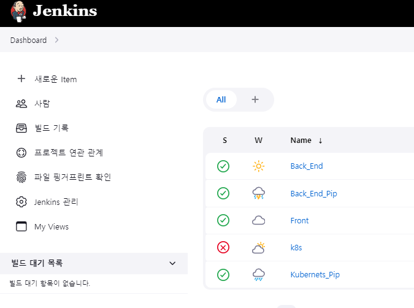

<h1 align="center">제목 정하는 중 👍</h1>

<center>
    
</center>

> [한국품질재단] 스마트팩토리SW개발과정 / 4팀

🎬[Demo 시연영상](https://www.youtube.com/watch?v=dhMrKTwNI8U&lc=UgzCJR3WxkvsckRyyO94AaABAg&ab_channel=%EB%94%B0%EB%9D%BC%ED%95%98%EB%A9%B4%EC%84%9C%EB%B0%B0%EC%9A%B0%EB%8A%94IT)  
🎤[발표](https://www.youtube.com/watch?v=dhMrKTwNI8U&lc=UgzCJR3WxkvsckRyyO94AaABAg&ab_channel=%EB%94%B0%EB%9D%BC%ED%95%98%EB%A9%B4%EC%84%9C%EB%B0%B0%EC%9A%B0%EB%8A%94IT)  
📃[프로젝트 회고록](https://joon-coding.tistory.com/)

<br>

## ✨ 프로젝트 설명

```sh
배터리 산업에 필요한 원자재의 가격을 수집하고
AI 모델을 활용해 가격예측을 하는 프로젝트 입니다
```

## 🎬 [데모 사이트](http://3.39.23.184/) <- 클릭하면 이동됩니다!

```sh
현재는 AWS 프론트엔드, 백엔드, RDS로 배포한 상태입니다.
```

## 📌 프로젝트 목표

```sh
python을 사용해 데이터 크롤링을 하여 DB에 저장을 하고
Java Spring을 통해 데이터를 불러와
React를 사용해 User가 차트를 통해 자재정보를 보여주는 서비스를 만들었습니다
```

## 🔍 Overview

### 1. 데이터 크롤링(크롤링 방식 설명)

<center>
    <!--  -->
</center>
python을 사용해 데이터 크롤링을 하고 WAS에 전달하여 데이터 저장
<수집장면 넣을 예정>
<br>

### 2. 원자재 정보 저장

<center>
    <!--  -->
</center>
데이터 크롤링한 데이터를 저장
데이터 종류<br>
- 수집할 원자재 정보<br>
- 원자재 가격정보<br>
- 원자재의 해당하는 이슈 정보<br>

<br>

### 3. kubernetes를 사용한 클라우드 시스템 구축

<center>
    
</center>
kubernetes를 자원 사용의 효율을 높이고 윤영 관리의 편의성을 높여주었습니다<br>

<br>

### 3-1. kubernetes Blue/Green 배포 설청

Jenkins와 연동해 배포시 Blue/Green 형식으로<br>
배포 횟수가 홀수시 최신버전이 A 컨트롤러에 2개의 Pod가 생성되고<br>
이전 버전인 B컨트롤러 Pod가 2개 삭제 되는 방식으로 구현하였습니다<br>
(짝수의 경우 A, B 컨트롤러 반대로 진행)

<br>

### 3-2. kubernetes MySQL 2중화를 사용해 DB 저장 안정성 구축

DB를 master와 slave로 2중화 하여 백업용 DB를 통해

<br>
*문제사항<br>
- mysql Pod 고정해서 지정<br>
- mysql user 보안<br>
- kubernetes 네트워크<br>

<br>

### 4. Jenkins를 사용한 CI/CD

<center>
    
</center>
Jenkins를 사용해 AWS와 kubernetes 자동화 배포 실행

<br>
## 🔧 각 프로젝트 상세 설명

### [프론트 엔드 github](https://github.com/Resource-Predicters/Front_End) <- 클릭하면 이동됩니다!

### [백 엔드 github](https://github.com/Resource-Predicters/Back_End) <- 클릭하면 이동됩니다!

### [데이터수집 & 인공지능 github](https://github.com/Resource-Predicters/Data) <- 클릭하면 이동됩니다!

## 🤼‍♂️팀원

Team Leader : 🐯**이재준**

DataGathering : 🐶 **박선규**

Frontend : 🐺 **이윤정**

CI/CD : 🐱 **홍미지**
